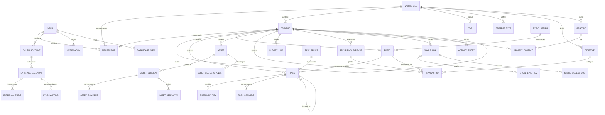
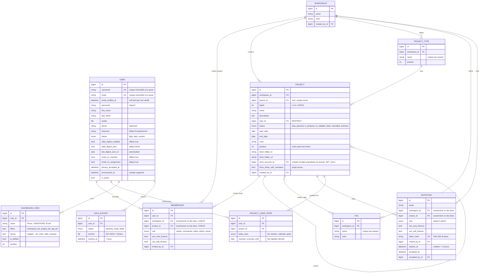
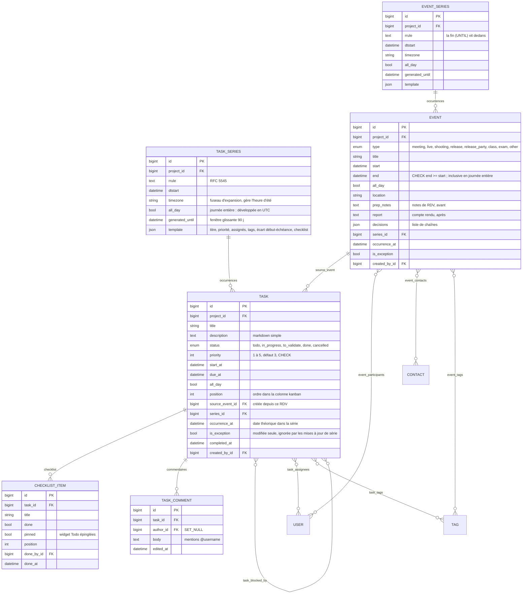
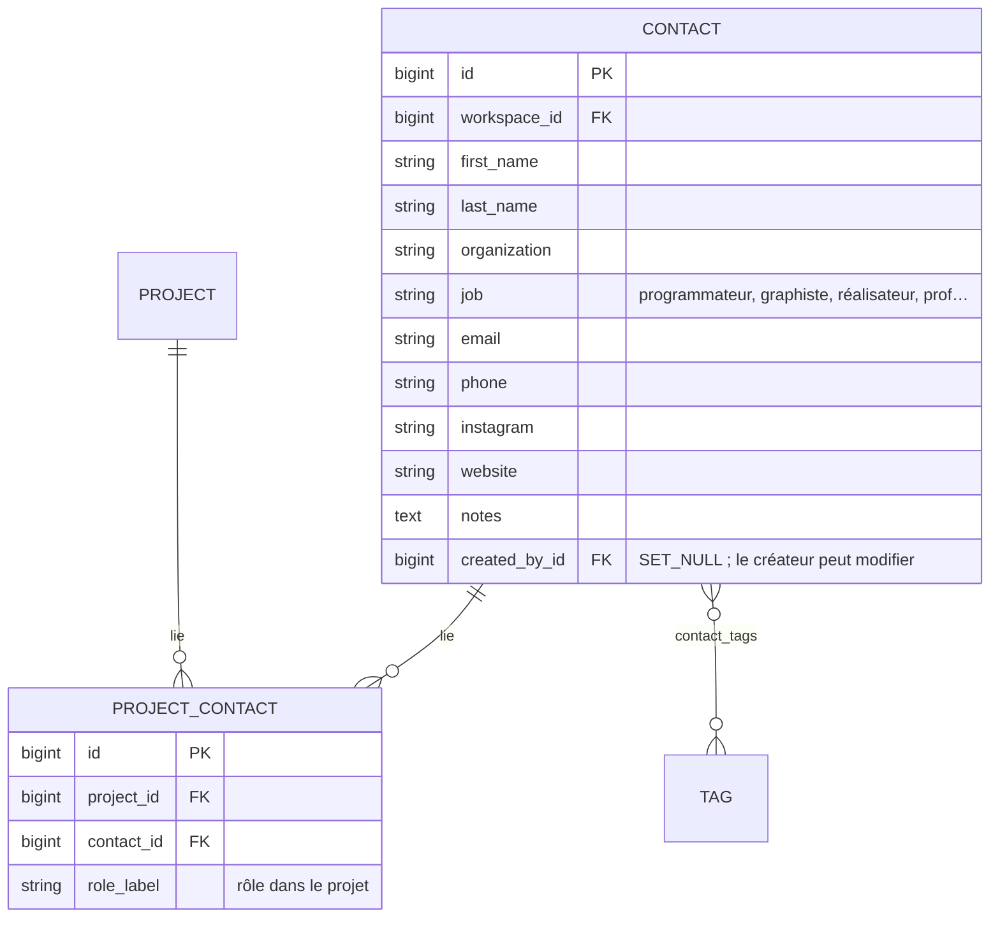
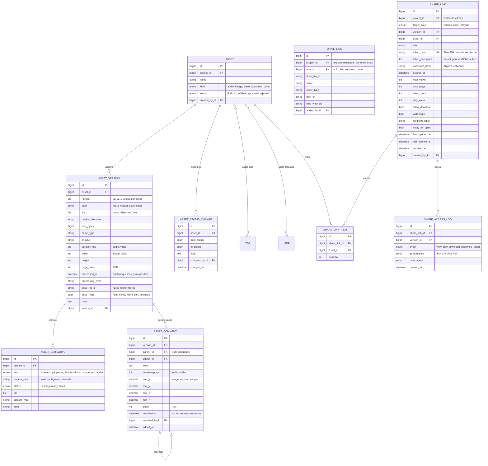
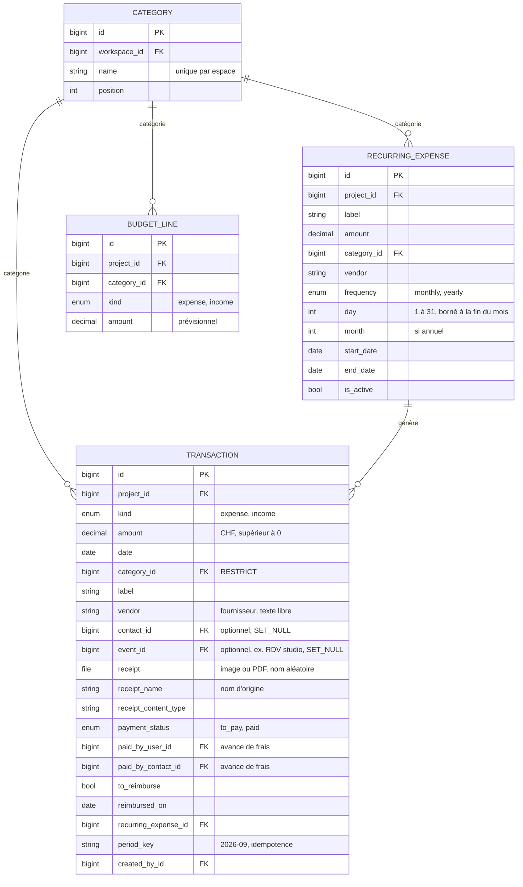
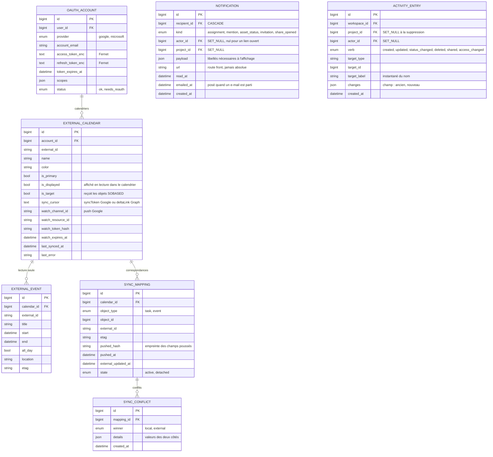

# SOBASED : schéma de la base de données

PostgreSQL 16. Ce document décrit le schéma **cible complet** (phases 1 à 14). Il est validé en phase 0, puis tenu à jour à chaque migration. En cas de divergence, les modèles Django font foi et ce fichier est corrigé dans le même commit.

Conventions :

- Clés primaires `bigint` auto-incrémentées. Les identifiants publics (liens de partage, invitations) utilisent des jetons aléatoires séparés, jamais l'id.
- Toutes les dates-heures sont stockées en UTC (`timestamptz`). Le fuseau de l'utilisateur sert uniquement à l'affichage, au résumé quotidien et à l'expansion des récurrences.
- Éléments « journée entière » (`all_day = true`) : la date est stockée à minuit UTC et seule la partie date est significative, quel que soit le fuseau (même convention que Google Calendar et FullCalendar). La date de fin est **inclusive** en base ; la conversion en fin exclusive se fait à la frontière (FullCalendar, Google, Graph).
- Montants : `numeric(12,2)`, toujours positifs, le signe vient de `kind`.
- Couleurs : chaîne `#RRGGBB` choisie dans une palette pastel côté front (la base ne contraint pas la palette).
- `created_at` / `updated_at` sur toutes les tables métier (omis des diagrammes pour la lisibilité).
- Suppressions : `CASCADE` du projet vers son contenu ; `SET_NULL` vers les auteurs (compte anonymisé, jamais supprimé physiquement) ; `RESTRICT` sur les catégories et types utilisés (un type utilisé ne se supprime pas seul, mais la suppression d'un espace entier cascade ; `PROTECT` la bloquerait).

## 1. Vue d'ensemble

## 2. Comptes, espaces, projets, droits

Contraintes clés :

- `MEMBERSHIP` : `CHECK ((workspace_id IS NULL) <> (project_id IS NULL))` ; unique `(user, workspace)` et unique `(user, project)` (index partiels) ; **un seul `owner` par portée** (index unique partiel sur `workspace_id WHERE role='owner'`, idem projet).
- Le propriétaire d'un espace est la ligne `MEMBERSHIP(role=owner)` de l'espace : une seule source de vérité pour les droits. L'API expose `owner` en lecture seule. Le créateur d'un **projet racine** reçoit une adhésion `owner` sur ce projet.
- `owner` a toujours `can_view_finance = can_edit_finance = true` (imposé à l'enregistrement).
- `PROJECT` : `CHECK (depth BETWEEN 1 AND 4)` ; `depth = parent.depth + 1` et `workspace = parent.workspace` validés dans `Project.clean()` + test ; pas de champ `root` ni de chemin matérialisé : la chaîne d'ancêtres fait 3 sauts au maximum et l'arbre complet d'un espace est chargé en une requête.
- La temporalité (Passé / En cours / À venir) et le retard sont **calculés**, jamais stockés.

## 3. Tâches et événements

- `task_blocked_by` : M2M asymétrique. Validation à l'écriture : les deux tâches partagent le même projet racine, et l'ajout ne crée pas de cycle (parcours en profondeur du graphe des bloqueurs).
- Unicité `(series, occurrence_at)` pour rendre la matérialisation idempotente, pour les tâches comme pour les événements. La fin d'une série vit dans son RRULE (`UNTIL`), pas dans une colonne.
- `task.source_event_id` (phase 6) : posé à la création de la tâche, jamais modifié, `SET_NULL` si le RDV est supprimé. Référence par chaîne `"events.Event"` : `apps.events` importe `apps.tasks`, pas l'inverse.
- La couleur d'un événement n'est pas stockée : elle est héritée du projet à la lecture.
- Une occurrence d'événement qui porte un compte rendu ou des décisions n'est jamais supprimée par une scission de série (`apps/events/services.py`).

## 4. Contacts

Unique `(project, contact)`. Index `(workspace, last_name, first_name)`. Visibilité : membre de l'espace = tout le carnet ; invité d'un projet = contacts liés à ses projets (`ContactQuerySet.for_user`).

## 5. Fichiers, versions, partage

- `ASSET_VERSION` : `CHECK` exactement un de `file` / `drive_file_id` ; unique `(asset, number)`. Le fichier est stocké sous `assets/<projet>/<24 hex>.<ext>` (rien du nom d'origine), le dérivé sous `derived/<projet>/…`. Le type réel d'une version (`kind`, propriété) se déduit de son `mime_type` reniflé, celui de l'asset servant de secours : c'est lui qui décide de la visionneuse et des ancres acceptées.
- `ASSET` : index `(project, status)` pour le widget « À valider ».
- `ASSET_COMMENT` : `rect_*` en `decimal(6,3)` (pour cent) ; une réponse (`parent` non nul) n'a pas d'ancre ; `resolved_at` / `resolved_by` ne vivent que sur la racine.
- `ASSET_DERIVATIVE` : unique `(version, kind, params_hash)` = cache des dérivés.
- `SHARE_LINK` : tous les assets ciblés appartiennent à `project` ou à ses descendants. Jeton `secrets.token_urlsafe(32)` (32 octets). Seul le hash sert à la recherche ; la copie chiffrée (Fernet, `FERNET_KEY`) permet de réafficher l'URL aux Éditeurs sans stocker le jeton en clair. L'état (actif / expiré / épuisé / révoqué) est calculé, jamais stocké. `password_hash` utilise les hacheurs Django (Argon2).
- `SHARE_LINK_ITEM` : unique `(share_link, asset)`.
- `SHARE_ACCESS_LOG` : index `(share_link, created_at)` ; `version` en `SET_NULL` (le journal survit à une version supprimée).
- Les filigranes sont des `ASSET_DERIVATIVE` de kind `wm_image` / `wm_audio`, `params_hash` = SHA-256 du texte, ou du tag et de l'intervalle.

## 6. Compta

- « À justifier » est **calculé** : `kind = expense AND receipt = ''`. Pas de statut stocké qui pourrait diverger du fichier. Le fichier est supprimé avec la ligne, cascade comprise (signal `post_delete`).
- Clés vers `CATEGORY` en `RESTRICT` (migration `finance.0003`) : une catégorie utilisée ne se supprime pas seule (l'API la remplace d'abord), mais la suppression d'un espace entier cascade. `PROTECT` bloquait cette cascade.
- `amount` : `DECIMAL(12,2)`, `CHECK amount > 0`. Contrainte `CHECK` : au plus un de `paid_by_user` / `paid_by_contact`.
- Avance de frais : au plus un de `paid_by_user` / `paid_by_contact`. « À rembourser » = `to_reimburse AND reimbursed_on IS NULL`.
- Unique `(recurring_expense, period_key)` : Celery beat peut tourner plusieurs fois sans doublon.
- Unique `(project, category, kind)` sur `BUDGET_LINE`. Les cumuls parents sont calculés (un `GROUP BY project` + somme dans l'arbre en mémoire), jamais stockés.

## 7. Intégrations, notifications, activité

- `OAUTH_ACCOUNT` : unique `(user, provider)` en v1 (un compte Google et un compte Microsoft par utilisateur).
- `SYNC_MAPPING` : unique `(calendar, object_type, object_id)` et unique `(calendar, external_id)`. La correspondance est **par utilisateur** (via son calendrier cible) : un même RDV peut être poussé dans le calendrier de chaque participant.
- `ACTIVITY_ENTRY` et `NOTIFICATION` référencent leur cible par `target_type` + `target_id` / `url` plutôt que par clé étrangère générique : le journal survit à la suppression de l'objet. `NOTIFICATION` garde en plus les libellés dans `payload` (dont `actor_name`) pour rester lisible quand l'acteur ou le projet a disparu. Index `(recipient, read_at)` pour le compteur de non-lues.
- Rétention : `ACTIVITY_ENTRY` et `SHARE_ACCESS_LOG` purgés après 12 mois, `INVITATION` expirées après 30 jours, `DATA_EXPORT` après 7 jours.

## 8. Tables Django standard

`django_session` (sessions, backend `cached_db`), `django_migrations`, `django_content_type`, `auth_permission` / `auth_group` (inutilisés hors admin Django), tables Celery beat **non** stockées en base (planning déclaré dans `config/celery.py`).

## 9. Index prévus

| Table | Index | Usage |
|---|---|---|
| `task` | `(project, status)`, `(due_at)`, `(series, occurrence_at)` unique | listes, retard, matérialisation |
| `task_assignees` | `(user)` | Mes tâches, dashboard |
| `event` | `(project, start)`, `(start)` | calendrier |
| `project` | `(workspace, parent)`, `(end_date)` | arbre, modale de fin dépassée |
| `membership` | `(user)` + uniques partiels | résolution des droits |
| `transaction` | `(project, date)`, `(date)`, `(recurring_expense, period_key)` unique | compta, dashboard |
| `share_link` | `(token_hash)` unique | page publique |
| `notification` | `(recipient, read_at)` | cloche |
| `activity_entry` | `(project, created_at)` | onglet Activité, purge |
| `external_event` | `(calendar, start)`, `(calendar, external_id)` unique | calendrier |
